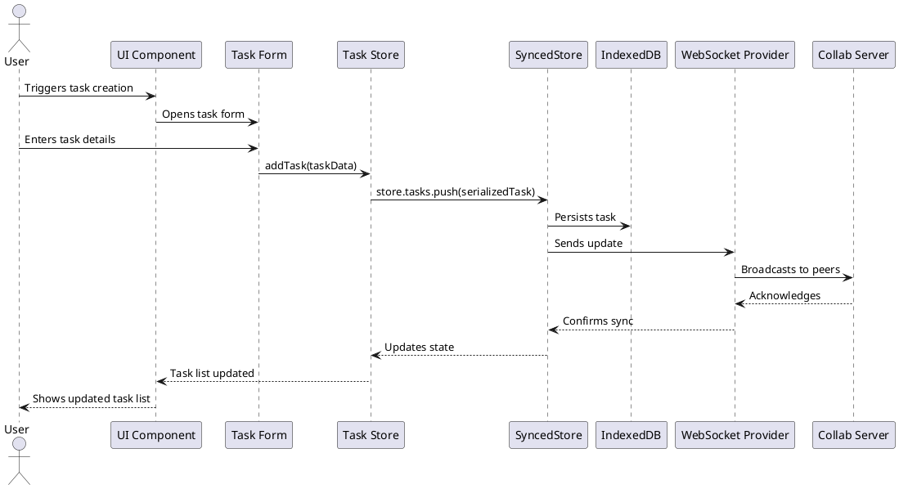
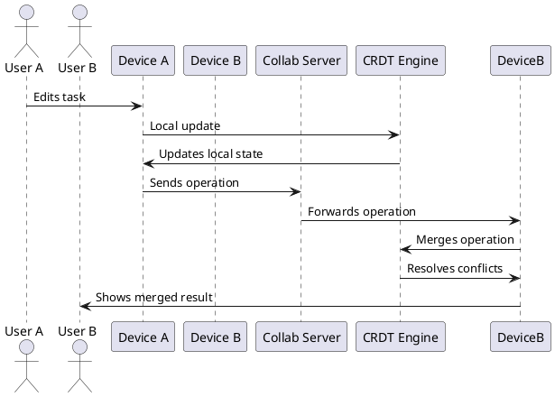

# Task Manager Architecture Documentation

## 1. Introduction and Goals

### 1.1 Requirements Overview

The Task Manager is a modern task management application with the following key requirements:

- **Functional Requirements**
  - Create, edit, and manage tasks with detailed information (title, descriptions, due dates, etc.)
  - Support for organizing tasks with tags/labels
  - Support for recurring tasks (monthly, quarterly, yearly)
  - Calendar integration for date-based navigation
  - Track completed tasks and provide a task logbook
  - Search and filter capabilities
  - Data export functionality

- **Non-Functional Requirements**
  - Offline-first capability
  - Real-time collaboration with multi-user editing
  - Progressive Web App (PWA) support for cross-platform accessibility
  - Responsive design for various devices
  - High performance on standard web browsers

### 1.2 Quality Goals

| Priority | Quality Goal | Motivation |
|----------|--------------|------------|
| 1 | Offline Usability | Users must be able to work with their tasks even when offline |
| 2 | Data Consistency | Tasks must remain consistent across devices and during collaboration |
| 3 | Responsiveness | Interface must be fast and responsive regardless of task count |
| 4 | Usability | Interface should be intuitive with minimal learning curve |
| 5 | Extensibility | Architecture should allow for easy addition of features |

### 1.3 Stakeholders

| Stakeholders | Expectations |
|--------------|------------|
| Task Users | Reliable task management with offline access and collaboration |
| Developers | Clean architecture, maintainable code, easy extension |

## 2. Architecture Constraints

### 2.1 Technical Constraints

- **Browser Compatibility**: Must work on modern browsers with IndexedDB and Service Worker support
- **Web Stack**: Built using SvelteKit ecosystem
- **Offline Storage**: Must use browser-based storage (IndexedDB)
- **Collaboration**: Must support multi-user editing using CRDT technology

### 2.2 Organizational Constraints

- **Open Source**: Components and libraries should preferably be open source
- **Maintainability**: Code must be maintainable and well-documented
- **Progressive Enhancement**: Core functionality must work without requiring advanced features

## 3. System Scope and Context

### 3.1 Business Context

```plantuml
@startuml Business Context
!include https://raw.githubusercontent.com/plantuml-stdlib/C4-PlantUML/master/C4_Context.puml

Person(user, "Task User", "A person who manages tasks")
Person(collaborator, "Collaborator", "A person who collaborates on tasks")

System(taskManager, "Task Manager", "Allows users to create, manage, and collaborate on tasks")
System_Ext(browser, "Web Browser", "Provides runtime environment")
System_Ext(websocketServer, "Collaboration Server", "Enables real-time collaboration through WebSockets")

Rel(user, taskManager, "Uses")
Rel(collaborator, taskManager, "Collaborates through")
Rel(taskManager, browser, "Runs in")
Rel(taskManager, websocketServer, "Syncs changes via")

@enduml
```

### 3.2 Technical Context

```plantuml
@startuml Technical Context
!include https://raw.githubusercontent.com/plantuml-stdlib/C4-PlantUML/master/C4_Context.puml

Person(user, "Task User", "A person who manages tasks")

System(taskManager, "Task Manager", "Task management application")

System_Ext(browser, "Web Browser", "Provides runtime environment")
System_Ext(indexedDB, "IndexedDB", "Local database for offline storage")
System_Ext(serviceWorker, "Service Worker", "Enables offline functionality")
System_Ext(websocketServer, "WebSocket Server", "Enables real-time collaboration")

Rel(user, taskManager, "Uses")
Rel(taskManager, browser, "Runs in")
Rel(taskManager, indexedDB, "Stores data in")
Rel(taskManager, serviceWorker, "Uses for offline capability")
Rel(taskManager, websocketServer, "Syncs changes via")

@enduml
```

## 4. Solution Strategy

The key architectural decisions:

1. **SvelteKit as UI Framework**: Provides excellent developer experience, small bundle size, and reactivity model.

2. **SyncedStore for Data Management**: Implements Conflict-free Replicated Data Type (CRDT) for conflict resolution and multi-user editing.

3. **Progressive Web App (PWA)**: Enables installation on devices and offline capabilities.

4. **Modular Component Structure**: Following a component-based architecture for maintainability and reusability.

5. **WebSocket for Real-time Collaboration**: Y-WebSocket provides the communication layer for multi-user support.

## 5. Building Block View

### 5.1 Level 1: System Context

```plantuml
@startuml System Context
!include https://raw.githubusercontent.com/plantuml-stdlib/C4-PlantUML/master/C4_Container.puml

Person(user, "Task User", "A person who manages tasks")

System_Boundary(taskManager, "Task Manager") {
    Container(frontend, "Frontend Application", "SvelteKit, TypeScript", "Provides UI and task management functionality")
    Container(dataStorage, "Data Storage", "SyncedStore, IndexedDB", "Handles data persistence")
    Container(syncEngine, "Sync Engine", "Y.js, WebSocket", "Synchronizes data between users")
    Container(pwa, "PWA Wrapper", "Service Worker, Manifest", "Enables offline mode and installation")
}

System_Ext(websocketServer, "Collaboration Server", "Node.js, WebSocket", "Handles real-time collaboration")

Rel(user, frontend, "Uses")
Rel(frontend, dataStorage, "Reads/writes data")
Rel(dataStorage, syncEngine, "Synchronizes through")
Rel(frontend, pwa, "Wrapped by")
Rel(syncEngine, websocketServer, "Communicates with")

@enduml
```

### 5.2 Level 2: Container View

```plantuml
@startuml Container View
!include https://raw.githubusercontent.com/plantuml-stdlib/C4-PlantUML/master/C4_Component.puml

Container_Boundary(frontend, "Frontend Application") {
    Component(routes, "Routes", "SvelteKit Routes", "Handles page routing and navigation")
    Component(components, "UI Components", "Svelte Components", "Reusable UI elements")
    Component(stores, "Stores", "Svelte Stores", "Manages application state")
    Component(syncedStore, "SyncedStore Integration", "TypeScript", "Connects to SyncedStore")
    Component(utils, "Utilities", "TypeScript", "Helper functions and business logic")
}

Container_Boundary(dataStore, "Data Storage") {
    Component(syncedStoreCore, "SyncedStore Core", "CRDT Implementation", "Handles data synchronization")
    Component(yjs, "Y.js", "CRDT Library", "Underlying CRDT implementation")
    Component(indexeddb, "IndexedDB Provider", "Y-IndexedDB", "Persists data locally")
}

Container_Boundary(syncEngine, "Sync Engine") {
    Component(websocketProvider, "WebSocket Provider", "Y-WebSocket", "Handles WebSocket communication")
    Component(awareness, "Awareness Protocol", "Y.js", "Tracks user presence and actions")
}

Container_Boundary(pwa, "PWA Components") {
    Component(serviceWorker, "Service Worker", "Vite PWA Plugin", "Enables offline functionality")
    Component(manifest, "Web Manifest", "JSON", "Defines installation properties")
}

Container_Ext(websocketServer, "Collaboration Server", "Node.js, Y-WebSocket", "Handles real-time collaboration")

Rel(routes, components, "Uses")
Rel(components, stores, "Reads/Updates")
Rel(stores, syncedStore, "Uses")
Rel(components, utils, "Uses")
Rel(syncedStore, syncedStoreCore, "Interfaces with")
Rel(syncedStoreCore, yjs, "Based on")
Rel(syncedStoreCore, indexeddb, "Persists via")
Rel(syncedStoreCore, websocketProvider, "Syncs through")
Rel(websocketProvider, awareness, "Includes")
Rel(websocketProvider, websocketServer, "Connects to")

@enduml
```

### 5.3 Level 3: Component View

```plantuml
@startuml Component View
!include https://raw.githubusercontent.com/plantuml-stdlib/C4-PlantUML/master/C4_Component.puml

Component_Boundary(taskStoreSystem, "Task Store System") {
    Component(taskTypes, "Task Types", "TypeScript", "Defines task data structures")
    Component(taskStore, "Task Store", "Svelte Store", "Main task state management")
    Component(syncedTaskStore, "Synced Task Store", "SyncedStore", "CRDT-enabled task store")
    Component(taskModels, "Task Models", "TypeScript", "Business logic for tasks")
    Component(taskUtils, "Task Utilities", "TypeScript", "Helper functions for tasks")
}

Component_Boundary(uiComponents, "UI Components") {
    Component(taskList, "Task List", "Svelte", "Displays list of tasks")
    Component(taskItem, "Task Item", "Svelte", "Individual task display")
    Component(taskForm, "Task Form", "Svelte", "Form for task creation/editing")
    Component(calendar, "Calendar View", "Svelte", "Calendar visualization")
    Component(filterComponents, "Filters", "Svelte", "Task filtering components")
}

Component_Boundary(dataSync, "Data Synchronization") {
    Component(storeProvider, "SyncedStore Provider", "Svelte", "Provides store context")
    Component(syncStatus, "Sync Status", "Svelte", "Shows synchronization status")
    Component(collabSettings, "Collaboration Settings", "Svelte", "Configuration for collaboration")
}

Rel(taskStore, syncedTaskStore, "Wraps")
Rel(syncedTaskStore, taskTypes, "Uses")
Rel(syncedTaskStore, taskModels, "Implements")
Rel(taskModels, taskUtils, "Uses")

Rel(taskList, taskItem, "Contains")
Rel(taskList, taskStore, "Subscribes to")
Rel(taskForm, taskStore, "Updates")
Rel(calendar, taskStore, "Reads from")
Rel(filterComponents, taskStore, "Filters")

Rel(storeProvider, syncedTaskStore, "Initializes")
Rel(syncStatus, storeProvider, "Reports on")
Rel(collabSettings, syncedTaskStore, "Configures")

@enduml
```

## 6. Runtime View

### 6.1 Task Creation Sequence



### 6.2 Multi-User Collaboration



## 7. Deployment View

```plantuml
@startuml Deployment View
!include https://raw.githubusercontent.com/plantuml-stdlib/C4-PlantUML/master/C4_Deployment.puml

Node(clientDevice, "Client Device", "User's PC/Mobile") {
    Container(browser, "Web Browser", "Chrome, Firefox, etc.", "Provides runtime environment")
    Container(appCode, "Task Manager App", "SvelteKit", "Task management application")
    Container(indexedDB, "IndexedDB", "Browser Storage", "Local data storage")
    Container(serviceWorker, "Service Worker", "Browser API", "Enables offline capability")
}

Node(collabServer, "Collaboration Server", "Node.js Server") {
    Container(wsServer, "WebSocket Server", "y-websocket-server", "Handles real-time updates")
    Container(docStorage, "Document Storage", "Y.js", "Temporary document state")
}

Rel(appCode, browser, "Runs in")
Rel(appCode, indexedDB, "Stores data in")
Rel(appCode, serviceWorker, "Registers & uses")
Rel(appCode, wsServer, "Connects to")
Rel(wsServer, docStorage, "Manages")

@enduml
```

## 8. Cross-cutting Concepts

### 8.1 User Interface

- **Component Architecture**: The UI is built using Svelte components, organized in a hierarchical structure.
- **Reactive Design**: Svelte's reactivity model ensures UI stays in sync with the application state.
- **Responsive Layout**: Tailwind CSS provides responsive design capabilities.
- **Keyboard Shortcuts**: Comprehensive keyboard shortcut support for power users.

### 8.2 Persistence

- **CRDT for Data**: Conflict-free Replicated Data Types ensure consistency during concurrent edits.
- **IndexedDB for Storage**: Browser's IndexedDB provides robust offline storage.
- **Serialization**: Custom serialization/deserialization for Date objects and complex structures.

### 8.3 Error Handling

- **UI Error Boundaries**: Components handle and display errors appropriately.
- **Recovery Mechanisms**: Store reset functionality for data corruption cases.
- **Offline-First**: Operations queue during offline mode and sync when connection is restored.

### 8.4 Security

- **Data Isolation**: Each user's data is isolated in their own browser storage.
- **Collaboration Security**: Room-based collaboration with optional security features.
- **Input Validation**: All user inputs are validated before processing.

## 9. Architecture Decisions

### 9.1 SvelteKit for Frontend

**Context**: Need for a performant, lightweight frontend framework.

**Decision**: Use SvelteKit for the frontend development.

**Rationale**:
- Excellent developer experience
- Minimal runtime compared to React or Vue
- Built-in SSR/SPA capabilities
- Strong typing with TypeScript support
- Component-based architecture

### 9.2 SyncedStore for Data Synchronization

**Context**: Need for offline-first data management with conflict resolution.

**Decision**: Use SyncedStore (based on Yjs) for data management.

**Rationale**:
- CRDT-based conflict resolution
- Support for real-time collaboration
- IndexedDB persistence
- Well-documented and maintained
- Svelte integration available

### 9.3 PWA for Cross-platform Support

**Context**: Need for cross-platform availability without native apps.

**Decision**: Implement as a Progressive Web App.

**Rationale**:
- Installation capability on desktop and mobile
- Offline support via Service Workers
- Push notifications support
- Native-like experience
- Automatic updates

## 10. Quality Requirements

### 10.1 Quality Scenarios

| Quality Attribute | Scenario | Expected Response |
|-------------------|-----------|-------------------|
| Availability | User loses internet connection | App continues to function with local data |
| Performance | Loading 1000+ tasks | UI remains responsive with minimal lag |
| Usability | First-time user creates a task | Task creation completes successfully without instructions |
| Data Integrity | Two users edit the same task | Changes merged without data loss via CRDT |
| Security | User stores sensitive task info | Data remains private and secure |

### 10.2 Quality Tree

- **Usability**
  - Intuitive interface
  - Keyboard shortcuts
  - Responsive design
  
- **Reliability**
  - Offline functionality
  - Data consistency
  - Error recovery
  
- **Performance**
  - Fast load times
  - Responsive interactions
  - Efficient synchronization
  
- **Maintainability**
  - Modular architecture
  - Consistent coding patterns
  - Comprehensive documentation

## 11. Risks and Technical Debt

### 11.1 Risks

| Risk | Probability | Impact | Mitigation |
|------|------------|--------|------------|
| Browser compatibility issues | Medium | High | Feature detection, polyfills |
| IndexedDB storage limits | Low | Medium | Implement data pruning for old tasks |
| WebSocket server failures | Medium | High | Robust reconnection logic, fallback to local-only |
| CRDT conflict edge cases | Low | High | Thorough testing, manual conflict resolution |

### 11.2 Technical Debt

- **SyncedStore Integration**: Current implementation may need refinement as the library evolves.
- **PWA Implementation**: Additional offline capabilities could be enhanced.
- **Component Structure**: Some components may benefit from further atomization.

## 12. Glossary

| Term | Definition |
|------|------------|
| CRDT | Conflict-free Replicated Data Type - data structure for concurrent edits |
| PWA | Progressive Web App - web app that can be installed on devices |
| SvelteKit | Frontend framework based on Svelte with routing and SSR |
| Y.js | CRDT implementation library used by SyncedStore |
| IndexedDB | Browser-based database for client-side storage |
| WebSocket | Communication protocol for real-time data exchange |

## 13. References

- [SyncedStore Documentation](https://syncedstore.org/docs/)
- [Yjs Documentation](https://docs.yjs.dev/)
- [SvelteKit Documentation](https://kit.svelte.dev/docs)
- [PWA Documentation](https://web.dev/progressive-web-apps/)